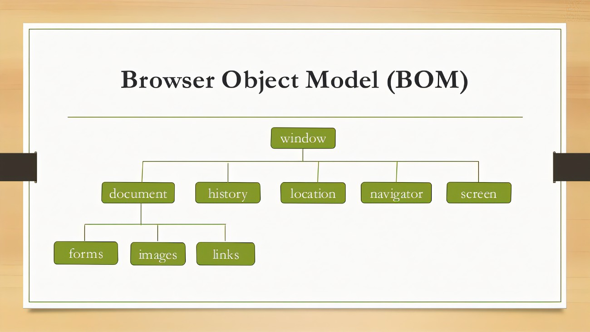
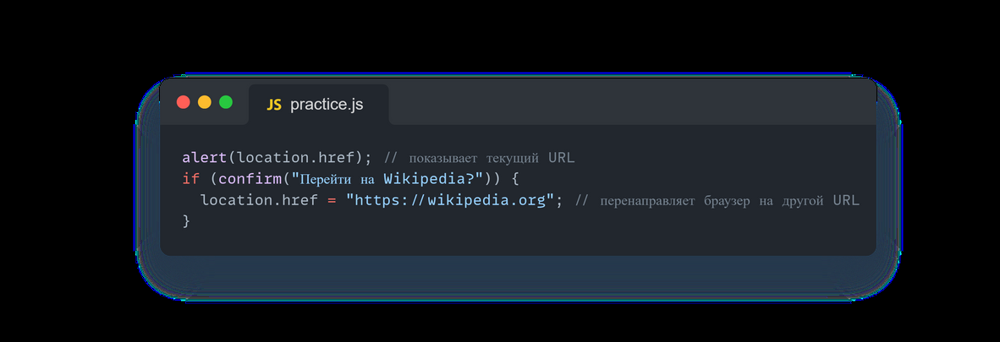
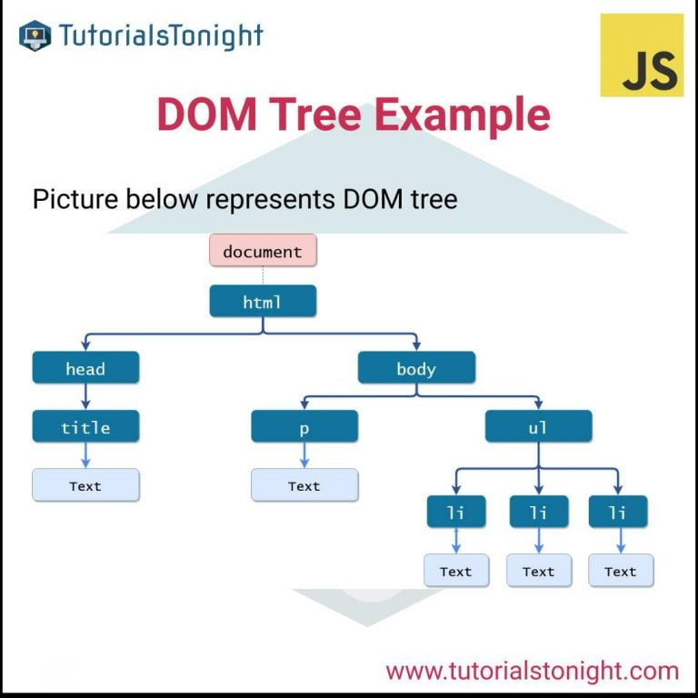
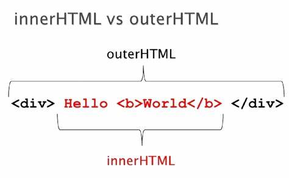
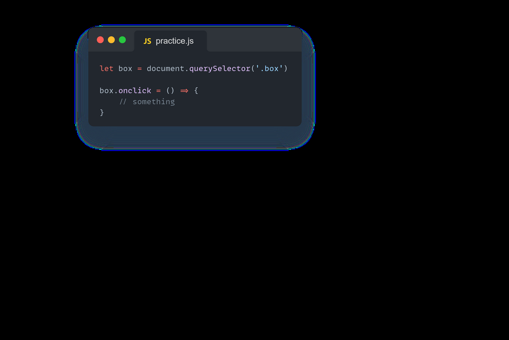

# ` What is Browser Object Model (BOM) in JavaScript ?`
### ModelThe Browser Object Model (BOM) allows JavaScript to "talk to" the browser

#### The Browser Object Model (BOM) is the additional objects provided by browser environment to work with everything other than document. 

# `What is Document Object Model-(DOM) in JavaScript ?`
### DOM - "Document Object Model". It's a standardized way of representing the structure of a document(such as HTML) as a tree-like structure, where each node represents a part of the document, such as anelement, attribute, text content, etc. DOM allows programs and scripts to access, manipulate, andupdate the content, structure, and styles of a web page. JavaScript is commonly used to interact withthe DOM in web development, for tasks such as dynamically changing the content of a page or handlinguser events

# `What is the quaerySelector() method ?`
### The querySelector() method returns the first element that matches a CSS selector. To return all matches use the querySelectorAll() instead
# `What is the HTML DOM Element innerHTML ?`
### innerHTML - this property completely provides an easy way replace the elementary element. For example, all requirements the element's body can be removed: the element's body can be removed:

## The Style object represents an individual style statement.
.jpeg>)
# `What is the onclick ?`
#### onclick -The user clicks an HTML element

